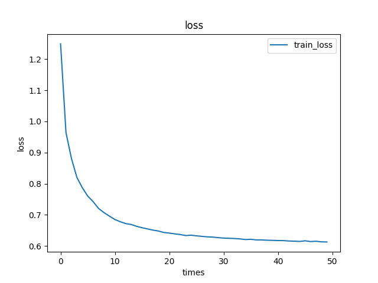
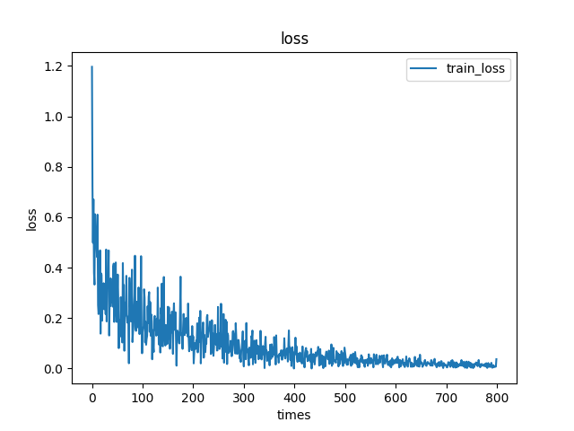

# CCF-AD-Predict

我们参考了[AD_Prediction](https://github.com/wangyirui/AD_Prediction)的解决方案

## 方法

我们使用了一个全卷积自编码器来进行预训练，骨干网络结构非常简单，仅有一层卷积和两层全连接。

传统的自编码器是由全连接层组成的，这就需要将数据展开成一维后输入网络进行训练，我们的数据是MRI三维数据，形状为79✕95✕79，展开后有五十多万的参数，这样的参数量训练起来非常的困难。[AD_Prediction](https://github.com/wangyirui/AD_Prediction)将其原始数据进行了切割，再输入自编码器网络进行训练，我们认为切割可能会造成数据特征的损坏丢失，所以我们选择了全卷积自编码器进行预训练。我们使用5✕5✕5的大核进行卷积，最后再使用sigmoid激活函数输出。训练自编码器的主要目的是对数据特征的学习，所以我们取消了池化层。自编码器在经过18轮训练后，损失下降结果非常理想，如下图

将训练好的自编码器中的编码器的权重和偏置加载到骨干网络的卷积层中，这让骨干网络在有一定基础上开始训练，而不是使用随机的权重和偏置。骨干网络经过200轮训练后收敛效果也很好，如下图

可能由于网络网络不够深，在加入Dropout过后，模型仍然存在过拟合问题。
